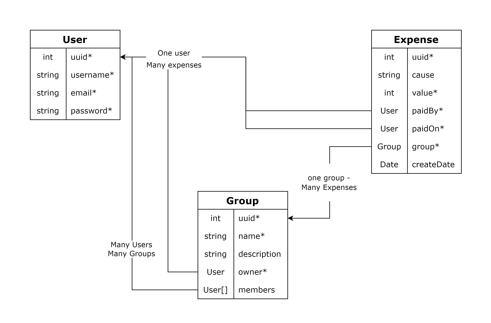
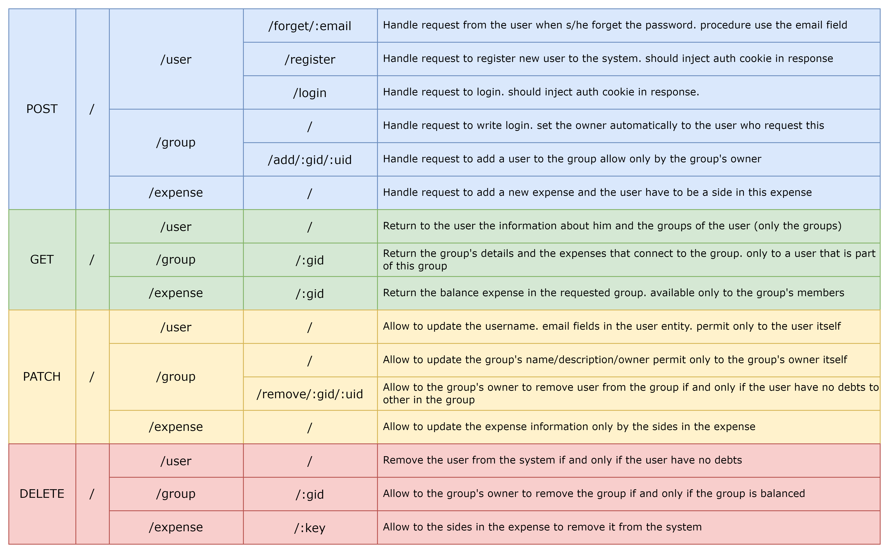
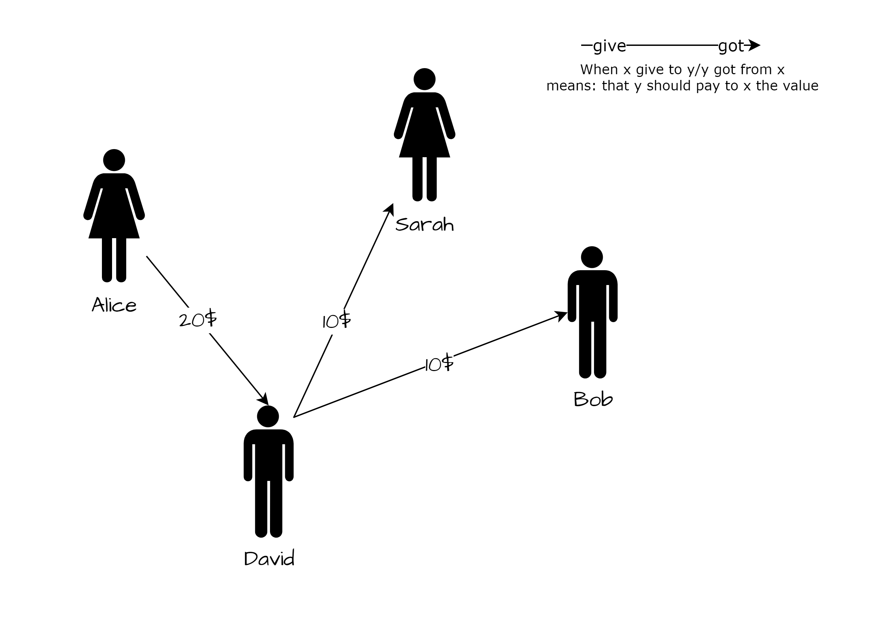
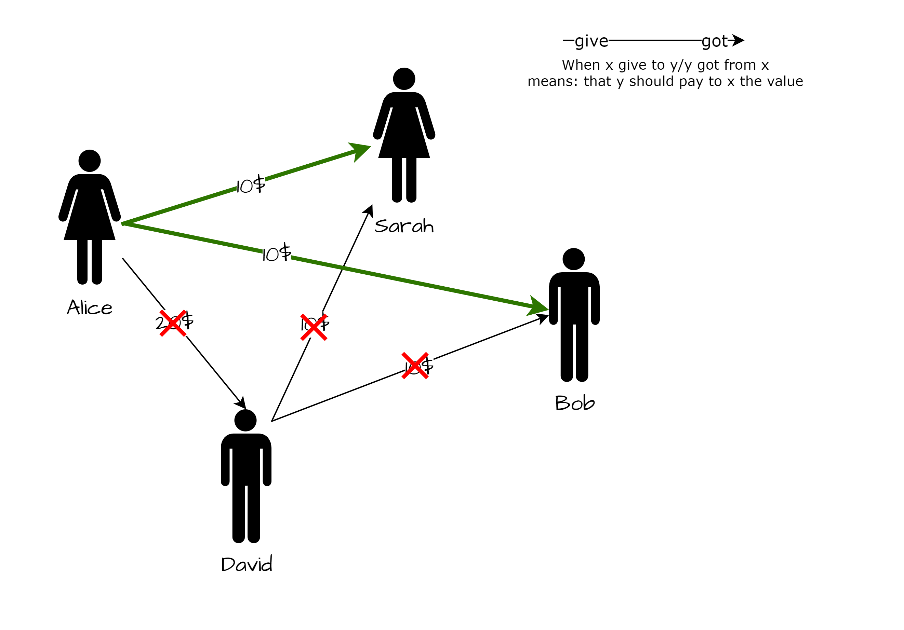
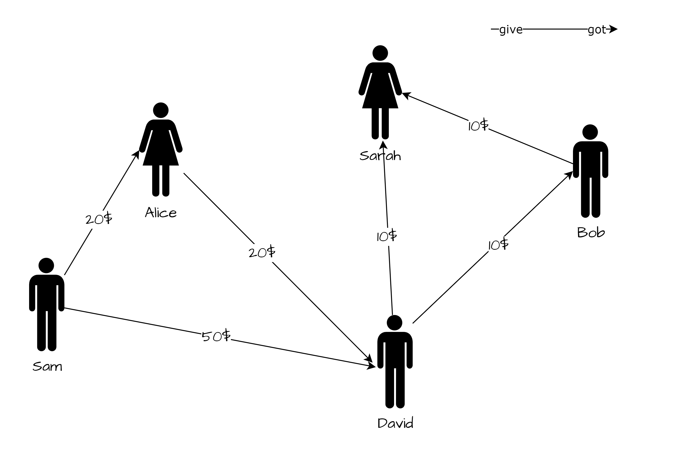

# SplitWiseServer
## Introduction

In this assignment, you will build a REST API using the NestJS Framework. The goal is to create a service application that simulates the functionality of Splitwise, a money management application among friends. Users can be part of groups and manage expenses between themselves, automatically settling debts within the group.

### Database Structures

To get started, run a Oracle container using the provided `docker-compose.yaml` file within your source code. Execute the following command to set up the container:

```
$ docker compose up
```
This will initialize the Oracle container.

__Remember__ : in the `docker-compose.yaml` you will find all the parameters for typorm to connect the DB

### Relations


## Routes & Endpoints 


## Algorithm Explanation 
To get some intuation for the algorithm problem lets have an example. 


Alice lent David $20, and David lent $10 each to Sarah and Bob. In this scenario, David has a $20 debt to Alice, while Sarah and Bob each owe $10 to David.

However, David wants to simplify the situation by excluding himself from the transactions. Instead of David paying Alice and then collecting from Sarah and Bob, the algorithm aims to bypass David. Sarah and Bob can pay Alice directly, thereby eliminating David from the equation.

The algorithm's goal is to simplify debts and loans by minimizing unnecessary transactions. It resolves debts in such a way that people who owe money and are owed money can be excluded from the process, reducing the number of transfers required.

And this will be the resolution


To read more about this problem you can read [here]('https://medium.com/@mithunmk93/algorithm-behind-splitwises-debt-simplification-feature-8ac485e97688')

__HINT__ Try to find an efficient algorithem without recursion methods.

Try it yourself

